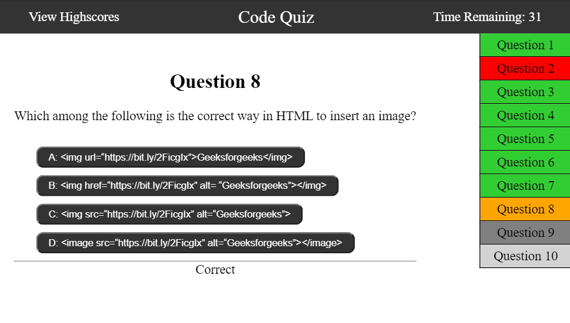

# Code Quiz

## Coding quiz website
* 10 randomly selected questions from the data bank will be used for a quiz (order and questions change each try).
* Quiz has a 1 minute timer which is further reduced by 10 seconds upon each wrong answer.
* Scores are saved to the browser's local storage to compare against previous quiz results. Results are sorted by quiz type and score value when displayed.
* Question list on the side shows correct / wrong results for previous questions.

Questions and answers were gathered from:
1. [ExamTiger.Com](https://www.examtiger.com/)
2. [W3Schools.Com](https://www.w3schools.com/quiztest/default.asp)
